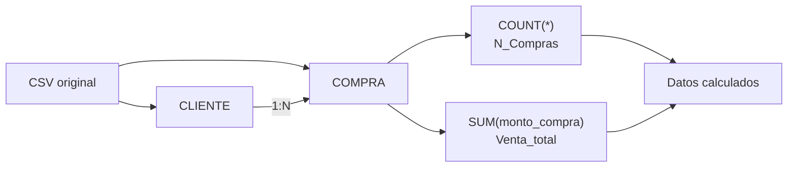

# Diagrama Entidad Relación


## 1. Preparación de datos

**Tipos de datos:**

- Enteros: `Edad`, `Genero`, `N_Compras`, `MetodoPago`, `Tiempo`, `Navegador`, `Boletin`, `Vale`
- Decimales: `Venta_total`, `MontoCompra`
- `FechaCompra` viene como texto en formato `dd.mm.yy` (ej. `02.02.21`), se convirtió a tipo fecha real para poder agrupar por mes/trimestre.

**Validación de dominios:** Se confirmó que las variables categóricas están dentro de los rangos que define el enunciado, sin valores fuera de catálogo:

- `Genero`: 0/1 (3,372 masculino, 3,128 femenino)
- `MetodoPago`: 0/1/2 (efectivo 1,207; tarjeta de crédito 3,827; tarjeta de débito 1,466)
- `Navegador`: 0–4 (0 = tienda física, con 3,523 registros; el resto repartido entre los 4 navegadores)
- `Boletin` y `Vale`: 0/1

**Diseño relacional:** Para cargarlo a la base de datos SQL en la nube no se dejará como una sola tabla plana, se normalizó en 4 tablas (como en la imagen inicial): `CLIENTE`, `COMPRA`, `METODO_PAGO` y `NAVEGADOR`, usando `MetodoPago` y `Navegador` como catálogos con clave foránea en vez de repetir el código numérico directamente en cada registro. `Venta_total` y `N_Compras` no se guardan como columnas fijas del cliente, sino que se calculan con una vista/consulta agregada sobre `COMPRA`, así se evita que esos totales queden desactualizados si se insertan nuevas compras.

Ejemplo:


Se hizo una verificación adicional, el dataset no tiene valores nulos, y tampoco hay filas duplicadas ni Id_cliente repetidos (cada cliente aparece una sola vez). No fue necesario imputar ni eliminar registros.

### Diagrama ER

- **CLIENTE** (`id_cliente` PK, `edad`, `genero`): 1 cliente puede tener muchas compras.
- **COMPRA** (`id_compra` PK, `id_cliente` FK, `fecha_compra`, `monto_compra`, `tiempo_seg`, `boletin`, `vale`, `id_metodo_pago` FK, `id_navegador` FK): tabla de hechos, una fila por transacción.
- **METODO_PAGO** (`id_metodo_pago` PK, `nombre`): catálogo: Efectivo / Tarjeta de crédito / Tarjeta de débito.
- **NAVEGADOR** (`id_navegador` PK, `nombre`): catálogo: Tienda física / Navegador 1–4.

### Planificación del proyecto

**División de tareas:** Se dividió el trabajo siguiendo las fases del alcance de la práctica:

1. Preparación de datos y modelado de base de datos.
2. Análisis exploratorio y visualizaciones.
3. Análisis de tendencias, segmentación y correlaciones.
4. Construcción del agente conversacional con Google ADK + MCP Server.
5. Redacción del informe final y respuestas a las preguntas de discusión.


**Herramientas y tecnologías:** Se usó Python (pandas para limpieza y análisis, matplotlib/seaborn o Power BI para visualizaciones) por su rapidez para manipular datos tabulares; una base de datos relacional en la nube (ej. Supabase/PostgreSQL o Azure SQL) para cumplir el requisito de "base de datos en la nube"; Google ADK para el agente conversacional, con un MCP Server propio que expone los resultados del análisis como herramientas consultables por el agente; y GitHub como repositorio para versionar el código.


### Proceso de análisis

Para preparar los datos se siguió un enfoque secuencial: primero se hizo una inspección inicial (`shape`, tipos de dato, `describe()`) para entender la estructura del CSV; luego se verificaron nulos y duplicados de forma explícita en vez de asumir que el archivo venía limpio; después se validó que cada variable categórica cayera dentro del dominio esperado (por ejemplo, que `Navegador` solo tuviera valores 0–4), y finalmente se convirtió `FechaCompra` a un tipo de dato fecha real, ya que venía como texto con formato `dd.mm.yy`, lo cual habría impedido agrupar u ordenar correctamente por mes.

Durante el análisis exploratorio, una de las decisiones importantes fue normalizar el CSV plano en varias tablas relacionadas en lugar de cargarlo tal cual a la base de datos. Aunque cargar el archivo "tal cual" hubiera sido más rápido, se prefirió separar los catálogos (`MetodoPago`, `Navegador`) de la tabla de compras para evitar redundancia y facilitar consultas SQL más limpias (por ejemplo, `JOIN` en vez de comparar números mágicos).

Un desafío durante el análisis fue interpretar correctamente la columna `Navegador`, ya que el valor 0 no representa "sin navegador" sino "tienda física", es decir, el dataset descrito como "ventas online del año 2021" en realidad ya mezcla ambos canales (54% tienda física, 46% en línea repartido entre 4 navegadores). Esto se documentó explícitamente para que el análisis de canales no se interpretara como si todo el dataset fuera puramente digital, lo cual es justamente relevante para la empresa que quiere expandirse a una sucursal física.

``` python
import pandas as pd
from sqlalchemy import create_engine

# 1. Lectura
df = pd.read_csv('Venta_online_c.csv', sep=';')

print(f"Registros: {df.shape[0]} | Columnas: {df.shape[1]}")
print(df.dtypes)
print(df.describe())

# 2. Nulos y duplicados
print("\nNulos:\n", df.isnull().sum())
print(f"\nFilas duplicadas: {df.duplicated().sum()}")

# 3. Validación de dominios
dominios = {
    'Genero': {0, 1},
    'MetodoPago': {0, 1, 2},
    'Navegador': {0, 1, 2, 3, 4},
    'Boletin': {0, 1},
    'Vale': {0, 1}
}

for columna, validos in dominios.items():
    fuera = set(df[columna].unique()) - validos
    print(f"{columna}: {'OK' if not fuera else fuera}")

# 4. Conversión de fecha
df['FechaCompra'] = pd.to_datetime(
    df['FechaCompra'],
    format='%d.%m.%y'
)
df['Mes'] = df['FechaCompra'].dt.month

# 5. Catálogos
metodo_pago = pd.DataFrame({
    'id_metodo_pago': [0, 1, 2],
    'nombre': [
        'Efectivo',
        'Tarjeta de crédito',
        'Tarjeta de débito'
    ]
})

navegador = pd.DataFrame({
    'id_navegador': [0, 1, 2, 3, 4],
    'nombre': [
        'Tienda física',
        'Navegador 1',
        'Navegador 2',
        'Navegador 3',
        'Navegador 4'
    ]
})

# 6. Tabla cliente
cliente = df[
    ['Id_cliente', 'Edad', 'Genero']
].rename(columns={
    'Id_cliente': 'id_cliente',
    'Edad': 'edad',
    'Genero': 'genero'
})

# 7. Tabla compra
compra = df[
    [
        'Id_cliente',
        'FechaCompra',
        'MontoCompra',
        'Tiempo',
        'MetodoPago',
        'Navegador',
        'Boletin',
        'Vale'
    ]
].rename(columns={
    'Id_cliente': 'id_cliente',
    'FechaCompra': 'fecha_compra',
    'MontoCompra': 'monto_compra',
    'Tiempo': 'tiempo_seg',
    'MetodoPago': 'id_metodo_pago',
    'Navegador': 'id_navegador',
    'Boletin': 'boletin',
    'Vale': 'vale'
})

compra.insert(0, 'id_compra', range(1, len(compra) + 1))

```

### Conclusión

Uno de los hallazgos más relevantes del análisis es que la edad del cliente no presenta una relación lineal significativa con el comportamiento de compra dentro de este dataset. Al calcular la correlación entre `Edad` y `Venta_total` se obtiene un valor de -0.025, y entre `Edad` y `N_Compras` de -0.05, ambos prácticamente nulos.


Esto se confirma al segmentar a los clientes en grupos etarios: el grupo de 18-25 años gasta en promedio Q207.8 con 5.27 compras, el de 26-35 años gasta Q212.7 con 5.25 compras, el de 36-45 años gasta Q204.7 con 5.04 compras, y así sucesivamente hasta el grupo de 56-79 años con Q192.5 y 4.73 compras.


Las diferencias entre grupos son mínimas, lo que indica que el gasto promedio y la frecuencia de compra se mantienen relativamente estables a lo largo de todo el rango de edades (18 a 79 años) representado en la base de datos.

Esto contrasta con la intuición inicial de que los clientes más jóvenes, por estar más habituados a comprar en línea, tenderían a gastar más o comprar con mayor frecuencia que los clientes de mayor edad, o viceversa. En la práctica, ninguno de los dos extremos se cumple de forma marcada.

Este hallazgo tiene una implicación directa para el negocio: no conviene diseñar estrategias de marketing, promociones o segmentación basadas principalmente en la edad del cliente, ya que esta variable no está explicando de forma significativa las diferencias en el valor de compra.

En su lugar, otras variables del dataset sí muestran relaciones más claras y accionables, como el canal de compra (tienda física representa el 54% de los registros frente a 46% en línea) o el uso combinado de boletines y vales, donde los clientes que reciben boletín tienen una probabilidad notablemente mayor de usar vale (811 de 2,921, contra 443 de 3,579 sin boletín).


Esto sugiere que la empresa debería reorientar sus esfuerzos de segmentación hacia el comportamiento transaccional y el canal de interacción del cliente, en lugar de asumir que la demografía por edad es un buen predictor de valor o lealtad.

Para una empresa que está a punto de abrir una sucursal física y ya reporta un porcentaje mayoritario de ventas por ese canal, esta conclusión también refuerza que la inversión en experiencia física y digital se debe pensar de forma transversal a todas las edades, y no como una estrategia dirigida solo a un segmento etario específico.

### Acciones concretas

1. **Rediseñar las campañas de marketing y fidelización basándolas en comportamiento transaccional (canal, uso de boletín/vale) en vez de en la edad del cliente**, ya que los datos muestran que la edad no diferencia el gasto ni la frecuencia de compra, mientras que sí existe una relación clara entre recibir boletín y usar vale. La empresa puede usar el boletín como palanca activa para incrementar el uso de vales y, con ello, la recurrencia de compra.

2. **Diseñar la sucursal física y el catálogo digital como canales complementarios y no como audiencias separadas**, dado que el 54% de las transacciones ya ocurren en tienda física frente a un 46% distribuido entre los 4 navegadores. Esto implica invertir en integrar inventario y promociones entre ambos canales (ej. vales/boletines válidos en cualquiera de los dos) en lugar de tratar la apertura de la sucursal como un canal nuevo e independiente del negocio online ya existente.
